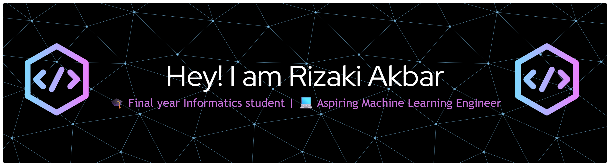

<h1 align="center">Hi 👋, I'm Rizaki Akbar</h1>
<h3 align="center">🎓 Final year Informatics student | 💻 Aspiring Machine Learning Engineer | 🌱 Lifelong Learner</h3>

## 🚀 About Me

- 🔭 Currently working on **Machine Learning projects** (NLP, Recommender System, Computer Vision)

- 👨‍💻 Team Lead in **Capstone Project (Dicoding x DBS Foundation)** – deteksi stress melalaui analisis chat dan sentiment
- 🎯 Active in **Student Organizations (BEM & others)** with strong leadership and communication skills
- 📚 Passionate about combining **AI & real-world applications**

  

<h3 align="left">Connect with me:</h3>

<h3 align="left">Languages and Tools:</h3>

        

&nbsp;

